# Zephpad（ゼフパッド）

AIツールへの入力や承認操作を簡単にすることを主目的とした、自作の左手用マクロパッドです。定型文の入力や、AIが提案した処理の承認・拒否など、繰り返し行う操作を手元のキーで実行できることを目指しています。

4個のキースイッチとロータリーエンコーダを備え、Seeed Studio XIAOを使用しています。ファームウェアはZephyrで実装する予定です。  

ケースはあくまで試作品です。  

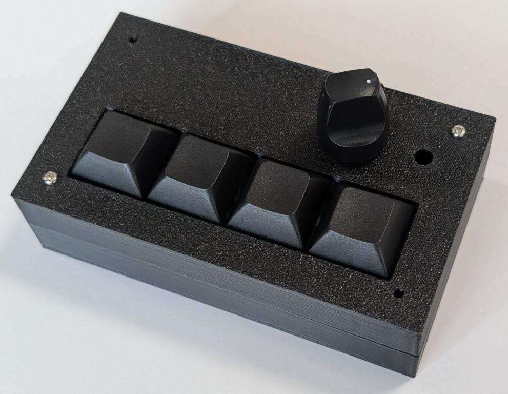

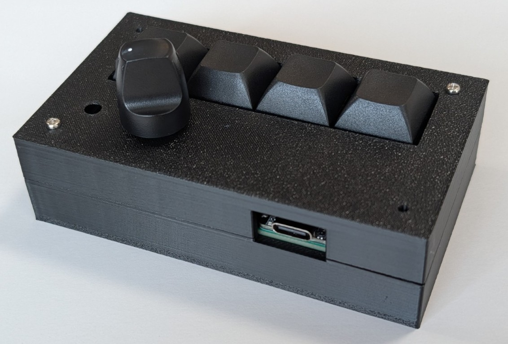

## 確認できていること

- 4個のキースイッチ入力、ロータリーエンコーダの読み取り、インジケータLEDの点灯。
- XIAO nRF52840で、LiPoバッテリー駆動によるBLEキーボードとしての文字入力。
- ピンヘッダー接続でXIAO nRF52840とXIAO RP2040を差し替え、同じArduinoソースコードを各ボード向けにビルドしてUSBキーボードとして動作。
- バッテリープラス端子のはんだ付け、および試作ケースの組み付け。

(Zephyr版の本格的な実装と、スリープ・ディープスリープによる省電力評価はこれからです。)

## ハードウェア

専用の試作プリント基板に、XIAO、キースイッチ4個、ロータリーエンコーダ、LEDと電流制限抵抗を実装しています。nRF52840を使う構成ではLiPoバッテリーを接続して動作を確認しています。

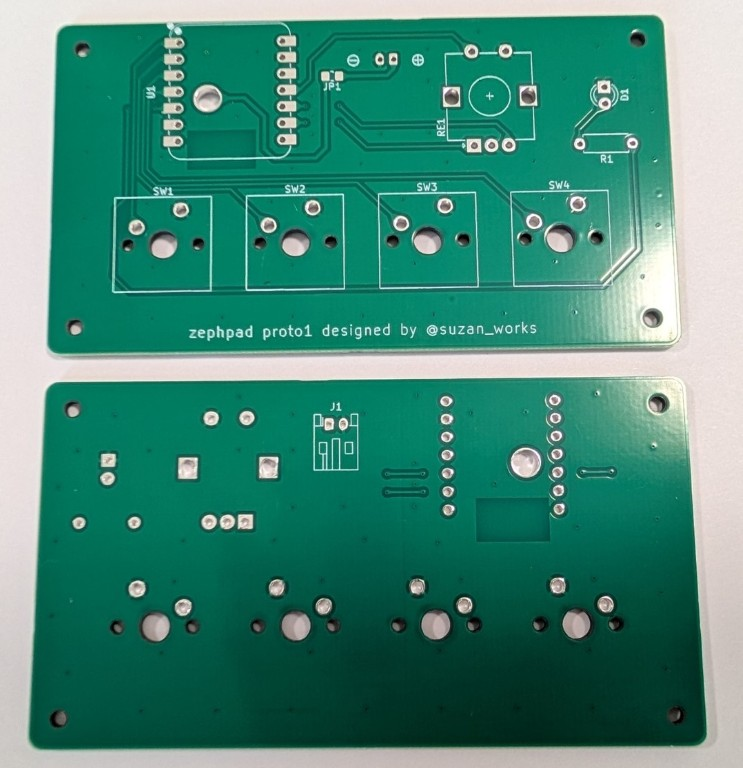

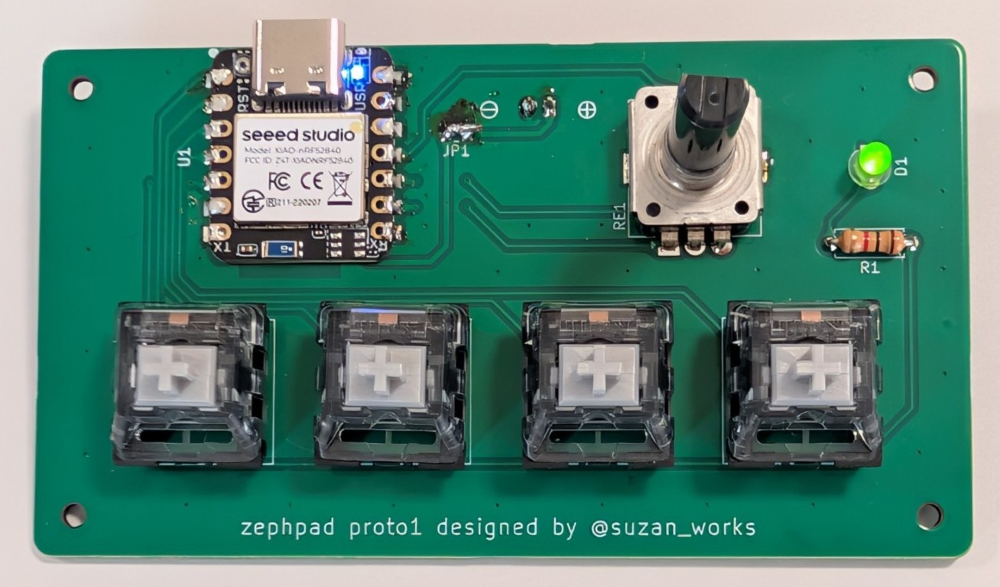

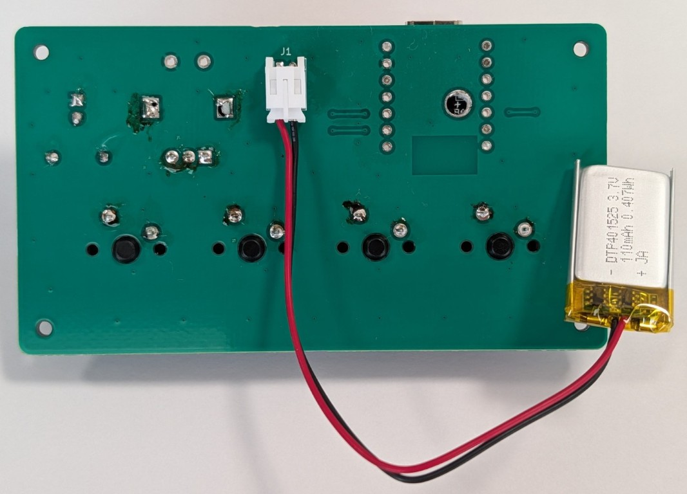

## 組み立ての概要と注意点

1. 基板に各部品とXIAOをはんだ付けします。
2. nRF52840でバッテリーを使用する場合は、基板裏側の大径スルーホールからXIAO裏面のBAT＋端子を接続します。
3. USBとバッテリーを外した状態で、TP1(BAT＋)とTP2(GND)の短絡がないことを確認します。

ハンダ付けの際に、ピンヘッダーでXiaoを固定すると位置が決めやすいです。(ズレが小さくできる)

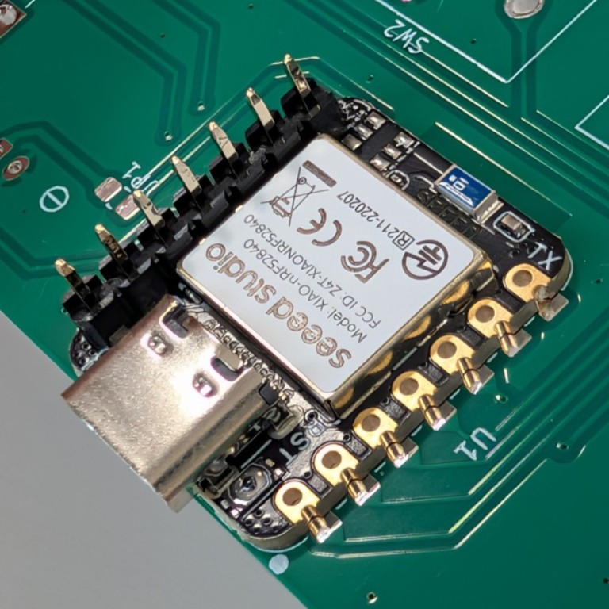

| BAT＋のはんだ付け前 | BAT＋のはんだ付け後 |
| --- | --- |
| 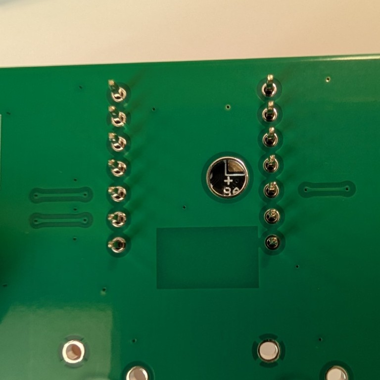 | 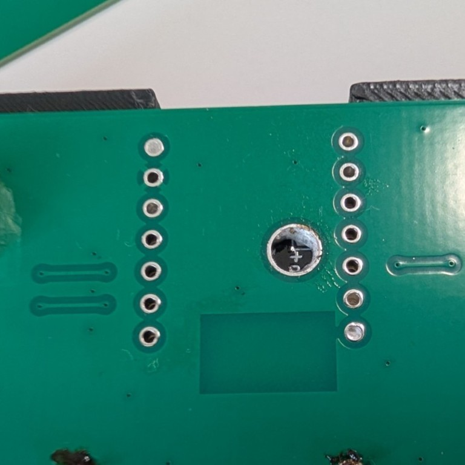 |

### はんだ付け後の短絡チェック

XIAOのはんだ付け後、USBとバッテリーを接続する前に、TP1（VBAT）とTP2（GND）が短絡していないことをテスターで確認します。

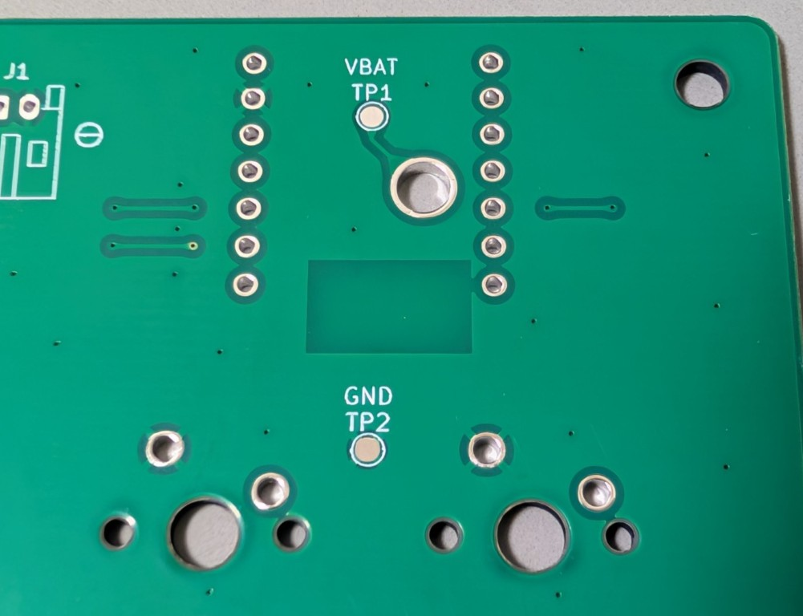

### XIAOの差し替え

ピンヘッダー接続の試作では、RP2040に差し替えてUSBキーボードとして動作を確認しています。

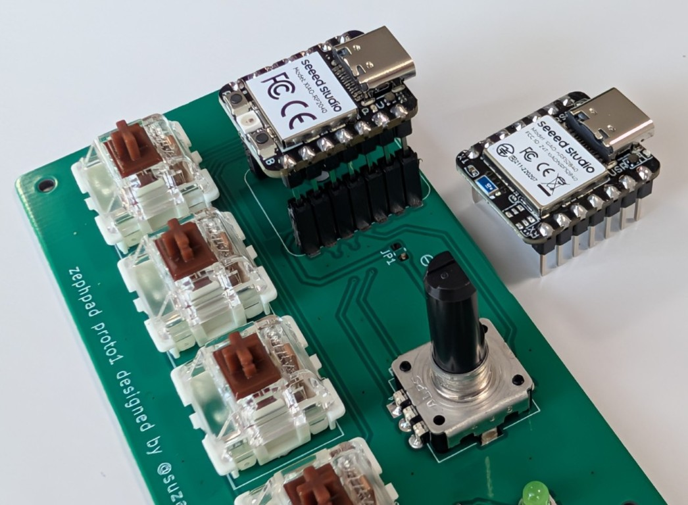

XIAO nRF52840とRP2040では、裏面のバッテリープラス端子を共用できません。Xiao RP2040を付けた場合は、有線USBキーボードのみの動作になります。

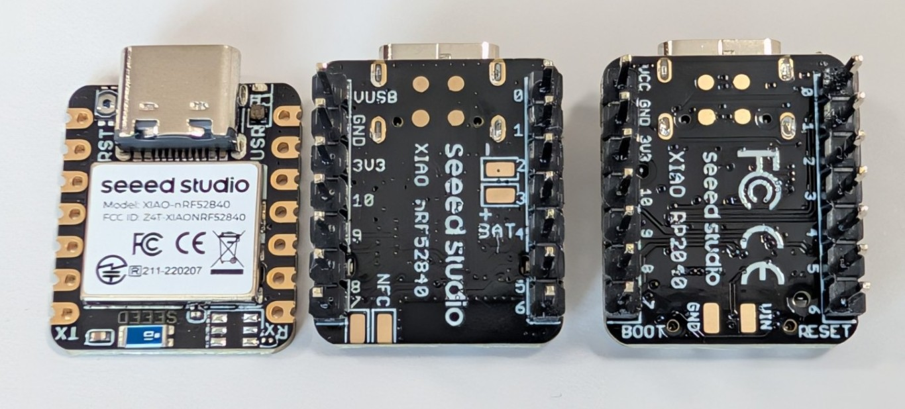

## 設計データ

KiCadプロジェクトは `hardware/kicad/zephpad/zephpad.kicad_pro` に配置します。

KiCanvasで設計データをブラウザから閲覧できます。

- [回路図をブラウザで見る](https://kicanvas.org/?repo=https%3A%2F%2Fgithub.com%2Fsuzan-works%2Fzephpad%2Fblob%2Fmain%2Fhardware%2Fkicad%2Fzephpad%2Fzephpad.kicad_sch)
- [基板設計ファイルをブラウザで見る](https://kicanvas.org/?repo=https%3A%2F%2Fgithub.com%2Fsuzan-works%2Fzephpad%2Fblob%2Fmain%2Fhardware%2Fkicad%2Fzephpad%2Fzephpad.kicad_pcb)

本資料は開発途中の試作記録です。バッテリー周りの安全性評価と、公開・配布に向けた条件の整理は完了していません。